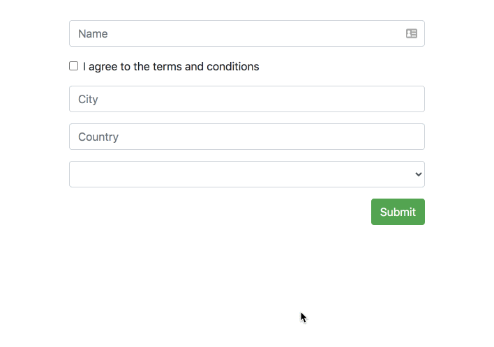

<p align="center">
  
</p>

<br />

> Making sure your tailor-made error solution is seamless!

[]()
[]()
[]()
[](https://github.com/prettier/prettier)
[](#contributors-)
[](https://github.com/ngneat/)
[]()

The Error Tailor offers seamless handling of form errors, saving you the trouble of repeating the error boilerplate.
It's fully customizable, so you can control when, where, and how each form field's errors are displayed.
Sit back, relax, and let the Error Tailor do all the work!



<a href="https://www.buymeacoffee.com/basalnetanel" target="_blank"></a>

## Getting Started

Run `ng add @ngneat/error-tailor`. This command updates the `AppModule`, and adds the `ErrorTailorModule` dependency:

<!-- prettier-ignore-start -->
```ts
@NgModule({
  declarations: [AppComponent],
  imports: [
    ReactiveFormsModule,
    ErrorTailorModule.forRoot({
      errors: {
        useValue: {
          required: 'This field is required',
          minlength: ({ requiredLength, actualLength }) => 
                      `Expect ${requiredLength} but got ${actualLength}`,
          invalidAddress: error => `Address isn't valid`
        }
      }
    })
  ],
  bootstrap: [AppComponent]
})
export class AppModule {}
```
<!-- prettier-ignore-end -->

The `errors` config property takes a partial `Provider`, that should provide a `HashMap<string | (err:any) => string>` that is an object with keys corresponding to the errors name that you want to handle, and values that can be a simple string, or function that return a string used as error message to be shown.
Now the only thing you need to add is the `errorTailor` directive to your form:

```html
<form [formGroup]="form" errorTailor>
  <div class="form-group">
    <input class="form-control" formControlName="name" placeholder="Name" />
  </div>

  <section formGroupName="address">
    <div class="form-group">
      <input class="form-control" formControlName="city" placeholder="City" />
    </div>

    <div class="form-group">
      <input class="form-control" formControlName="country" placeholder="Country" />
    </div>
  </section>

  <div class="form-group">
    <select formControlName="animal" class="form-control">
      <option *ngFor="let option of options; index as index" [ngValue]="option">
        {{ option.label }}
      </option>
    </select>
  </div>

  <button class="btn btn-success">Submit</button>
</form>
```

```ts
export class AppComponent {
  form: FormGroup;

  constructor(private builder: FormBuilder) {}

  ngOnInit() {
    this.form = this.builder.group({
      name: ['', [Validators.required, Validators.minLength(3)]],
      terms: [false, Validators.requiredTrue],
      animal: [null, Validators.required],
      address: this.builder.group(
        {
          city: ['', Validators.required],
          country: ['']
        },
        { validator: addressValidator }
      )
    });
  }
}
```

The directive will show all errors for a form field automatically in two instances - on the field element blur and on form submit.

## Inputs

- `controlErrorsClass` - A custom class that'll be added to the control error component, a component that is added after the form field when an error needs to be displayed:

```html
<input class="form-control" formControlName="city" 
       placeholder="City" controlErrorsClass="my-class" />
```

- `controlErrorsTpl` - A custom error template to be used instead of the control error component's default view: 

```html
<form errorTailor>
  <ng-template let-error let-text="text" #tpl> {{ error | json }} {{ text }} </ng-template>

  <div class="form-group">
    <input class="form-control" ngModel required name="name" [controlErrorsTpl]="tpl" />
  </div>

  <button class="btn btn-success">Submit</button>
</form>
```

- `controlErrorAnchor` - A custom `anchor` element for the control error component. The default anchor is the form field element:

```html
<div class="form-check form-group">
  <input type="checkbox" formControlName="terms" id="check" [controlErrorAnchor]="anchor" />
  <label class="form-check-label" for="check">
    I agree to the terms and conditions
  </label>
  <ng-template controlErrorAnchor #anchor="controlErrorAnchor"></ng-template>
</div>
```

The custom `anchor` can also be added as a directive, in which case it'll act as the anchor for any nested form fields:

```html
<div class="form-check form-group" controlErrorAnchor>
  <input type="checkbox" formControlName="terms" id="check" />
  <label class="form-check-label" for="check">
    I agree to the terms and conditions
  </label>
</div>
```

- `controlErrors` - Additional errors to use for the form field, that aren't specified in the config:

```html
<input class="form-control" formControlName="country" placeholder="Country"
       [controlErrors]="extraErrors" />
```

- `controlErrorsIgnore` - A custom attribute on a form field element to skip instantiating of a control error component on it.

One typical case when to use it is radio buttons in the same radio group where it's enough to show only one error message and not all of them for each separate radio button.

```html
<div class="form-group">
  Communication language: &nbsp;
  <input type="radio" name="languages" formControlName="languages" 
         value="en" id="en"    [controlErrorAnchor]="anchorRadio" />
  <label class="form-radio-label" for="en">English</label>
  <input type="radio" name="languages" formControlName="languages" 
         value="de" id="de" controlErrorsIgnore />
  <label class="form-radio-label" for="de">German</label>
  <input type="radio" name="languages" formControlName="languages" 
         value="cs" id="cs" controlErrorsIgnore />
  <label class="form-radio-label" for="cs">Czech</label>

  <ng-template controlErrorAnchor #anchorRadio="controlErrorAnchor"></ng-template>
</div>
```

- `controlErrorsOnAsync` - To modify the error display behavior to not show errors from async validators, set the following input:

```html
<input [controlErrorsOnAsync]="false" formControlName="name" />
```

- To modify the error display behavior and show the errors on submission alone, set the following input:

```html
<input [controlErrorsOnBlur]="false" [controlErrorsOnAsync]="false" formControlName="name" />
```

- `controlErrorsOnBlur` - To modify the error display behavior to not show errors on blur, set the following input:

```html
<input [controlErrorsOnBlur]="false" formControlName="name" />
```

## CSS Styling

The library adds a `form-submitted` to the submitted form. You can use it to style your inputs:

```css
.form-submitted input.ng-invalid,
.form-submitted select.ng-invalid {
  border-color: #dc3545;
}
```

## Config

- `blurPredicate` - Elements that should listen the `focusout` event. The default predicate is:

```ts
{
  blurPredicate(element) {
    return element.tagName === 'INPUT' || element.tagName === 'SELECT';
  }
}
```
- `controlErrorComponent` - Optional. Allows changing the default component that is used to render 
  the errors. This component should implement the `ControlErrorComponent` interface. If you only need to
  replace the error component's template, you may derive it from the default component, 
  `DefaultControlErrorComponent`, and provide the requisite HTML template.

  A common example is when using Ionic forms where each form field is wrapped in an `ion-item` and errors
  are best displayed as a sibling `ion-item` of the field. Example below shows how this can be done using 
  a custom control error component.

  For example:
  ```ts
  // Custom error component that will replace the standard DefaultControlErrorComponent.
  @Component({
    template: `
    <ion-item lines="none" class="ion-text-wrap" [class.hide-control]="hideError">
      <ion-label color="danger" class="ion-no-margin ion-text-wrap" stacked>
        {{ errorText }}
      </ion-label>
    </ion-item>
    `
  })
  export class IonicControlErrorComponent extends DefaultControlErrorComponent {
  }

  @NgModule({
    declarations: [AppComponent, IonicControlErrorComponent],
    imports: [
      ReactiveFormsModule,
      ErrorTailorModule.forRoot({
        errors: {
          useValue: {
            required: 'This field is required'
          }
        },
        controlErrorComponent: IonicControlErrorComponent
      })
    ],
    bootstrap: [AppComponent]
  })
  export class AppModule {}
  ```
- `controlErrorComponentAnchorFn` - Optional. A hook function that allows the error component's 
  HTML element to be repositioned in the DOM. By default error components are inserted at the
  bottom of the field with error. If your UI layout dictates a different positioning 
  scheme, you may use this hook.

  Since this error element can be placed anywhere in the DOM, it also has to be
  removed when the error component is destroyed. To provide for this, this
  function should return a callback that will then be invoked when the error component
  is destroyed. You may use this to remove the error HTML element that you inserted
  into the DOM yourself.

  Example below shows how the Ionic specific error component is repositioned in the DOM
  to suit Ionic's form layout. `hostElem` is the HTML element for the form control and
  `errorElem` is the HTML element for the error component. 
  ```ts
  anchorIonicErrorComponent(hostElem: Element, errorElem: Element) {
    hostElement.parentElement.insertAdjacentElement('afterend', errorElement);
    return () => {
      let errorNode = hostElement.parentElement.querySelector('custom-control-error');
      if (errorNode) {
        errorNode.remove();
      }
    };
  }

  @NgModule({
    declarations: [AppComponent, IonicControlErrorComponent],
    imports: [
      ReactiveFormsModule,
      ErrorTailorModule.forRoot({
        errors: {
          useValue: {
            required: 'This field is required'
          }
        },
        controlErrorComponent: IonicControlErrorComponent,
        controlErrorComponentAnchorFn: anchorIonicErrorComponent
      })
    ],
    bootstrap: [AppComponent]
  })
  export class AppModule {}
  ```

- `controlErrorsOnBlur` - To modify the error display behavior and show the errors on submission alone, set the following input:

```html
<input [controlErrorsOnBlur]="false" formControlName="name" />
```

## Recipes

### I18n Example

Here's how to support i18n:

```ts
import { TranslocoService } from '@ngneat/transloco';

@NgModule({
  declarations: [AppComponent],
  imports: [
    ErrorTailorModule.forRoot({
      errors: {
        useFactory(service: TranslocoService) {
          return {
            required: error => service.translate('errors.required')
          };
        },
        deps: [TranslocoService]
      }
    })
  ],
  bootstrap: [AppComponent]
})
export class AppModule {}
```

### Control Error Style

Here's a default style you can use for the error component:

```css
.control-error {
  width: 100%;
  margin-top: 0.25rem;
  font-size: 12px;
  color: #dc3545;
}
```

## Contributors ✨

Thanks goes to these wonderful people ([emoji key](https://allcontributors.org/docs/en/emoji-key)):

<!-- ALL-CONTRIBUTORS-LIST:START - Do not remove or modify this section -->
<!-- prettier-ignore-start -->
<!-- markdownlint-disable -->
<table>
  <tr>
    <td align="center"><a href="https://www.netbasal.com"><br /><sub><b>Netanel Basal</b></sub></a><br /><a href="https://github.com/@ngneat/error-tailor/commits?author=NetanelBasal" title="Code">💻</a> <a href="https://github.com/@ngneat/error-tailor/commits?author=NetanelBasal" title="Documentation">📖</a> <a href="#ideas-NetanelBasal" title="Ideas, Planning, & Feedback">🤔</a> <a href="#infra-NetanelBasal" title="Infrastructure (Hosting, Build-Tools, etc)">🚇</a></td>
    <td align="center"><a href="https://github.com/tonivj5"><br /><sub><b>Toni Villena</b></sub></a><br /><a href="https://github.com/@ngneat/error-tailor/commits?author=tonivj5" title="Code">💻</a> <a href="https://github.com/@ngneat/error-tailor/commits?author=tonivj5" title="Tests">⚠️</a></td>
    <td align="center"><a href="https://github.com/theblushingcrow"><br /><sub><b>Inbal Sinai</b></sub></a><br /><a href="https://github.com/@ngneat/error-tailor/commits?author=theblushingcrow" title="Documentation">📖</a></td>
    <td align="center"><a href="https://twitter.com/dmorosinotto"><br /><sub><b>Daniele Morosinotto</b></sub></a><br /><a href="https://github.com/@ngneat/error-tailor/commits?author=dmorosinotto" title="Code">💻</a> <a href="https://github.com/@ngneat/error-tailor/commits?author=dmorosinotto" title="Documentation">📖</a> <a href="#example-dmorosinotto" title="Examples">💡</a></td>
    <td align="center"><a href="https://github.com/rhutchison"><br /><sub><b>Ryan Hutchison</b></sub></a><br /><a href="https://github.com/@ngneat/error-tailor/issues?q=author%3Arhutchison" title="Bug reports">🐛</a> <a href="https://github.com/@ngneat/error-tailor/commits?author=rhutchison" title="Documentation">📖</a> <a href="https://github.com/@ngneat/error-tailor/commits?author=rhutchison" title="Code">💻</a> <a href="https://github.com/@ngneat/error-tailor/commits?author=rhutchison" title="Tests">⚠️</a></td>
    <td align="center"><a href="http://www.mlc.cz"><br /><sub><b>Miloš Lapiš</b></sub></a><br /><a href="https://github.com/@ngneat/error-tailor/commits?author=mlc-mlapis" title="Code">💻</a></td>
    <td align="center"><a href="http://www.smallpearl.com"><br /><sub><b>Hari Mahadevan</b></sub></a><br /><a href="https://github.com/@ngneat/error-tailor/commits?author=harikvpy" title="Code">💻</a></td>
  </tr>
</table>

<!-- markdownlint-enable -->
<!-- prettier-ignore-end -->
<!-- ALL-CONTRIBUTORS-LIST:END -->

This project follows the [all-contributors](https://github.com/all-contributors/all-contributors) specification. Contributions of any kind welcome!

Icon made by <a href="https://www.flaticon.com/authors/nhor-phai" title="Nhor Phai">Nhor Phai</a> from <a href="https://www.flaticon.com/" title="Flaticon"> www.flaticon.com</a>
